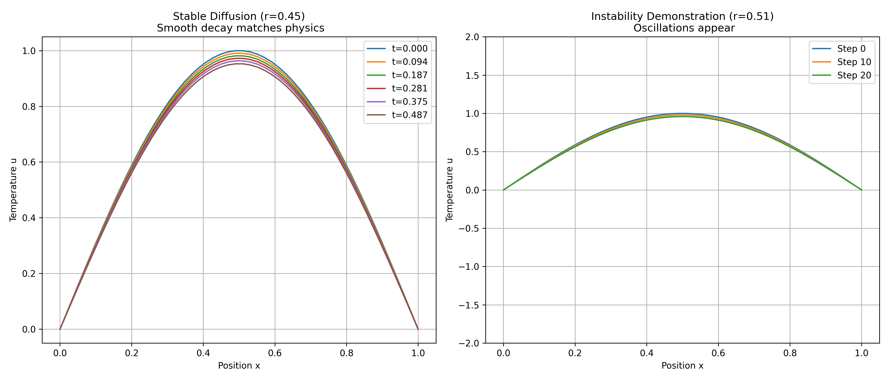
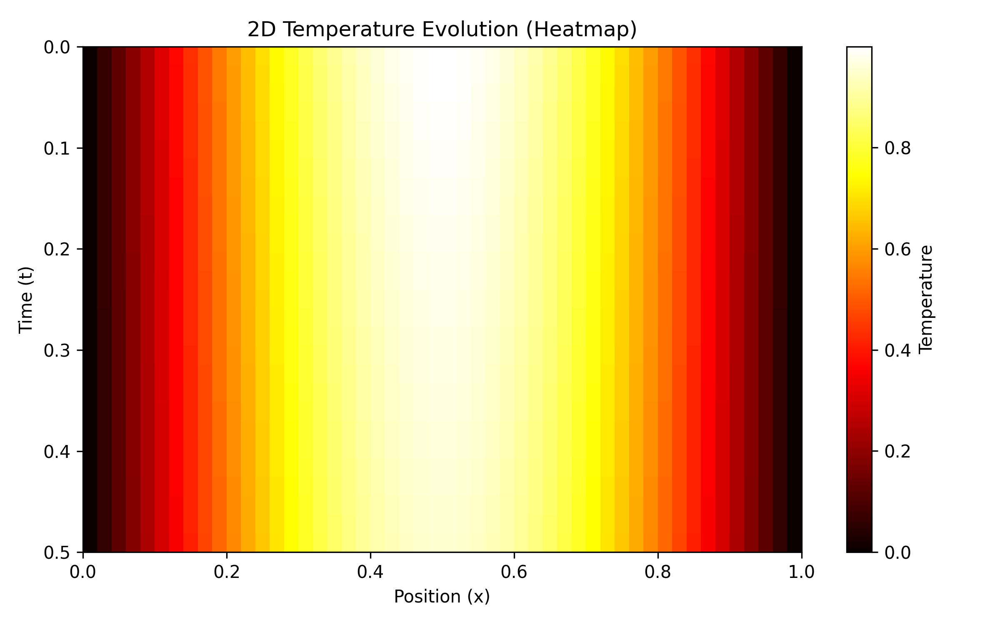

# Numerical Solution of the Heat Equation (Explicit FTCS)

**Topic:** D1 - Heat Equation (Explicit FTCS)  
**Assignment:** Numerical Analysis of Partial Differential Equations  
**Course:** CSE 261 - Numerical Methods  

---

## 👥 Group Draco

| SL | Student Name | ID |
|:--:|:---|:---|
| 1 | **Md. Kamran Hasan Rafin** | 2022000000066 |
| 2 | Samia Islam | 2024100000357 |
| 3 | Nazira Rahman | 2024100000204 |
| 4 | Rakib Hasan | 2023000000056 |
| 5 | Md. Nayemur Rahman | 2024100000163 |
| 6 | Alid Hasan Shuvo | 2024100000072 |
| 7 | Md. Tanvir Ahamed | 2024100000508 |
| 8 | Saiful Siddiky Labib | 2024100000469 |
| 9 | Mirza Jannatul Ferdous | 2022100000064 |
| 10 | Kazi Abu Hurayara Rizvi | 2024000000333 |

---

## 📝 Problem Statement
We aim to solve the one-dimensional transient **Heat Equation** using numerical differentiation techniques. The governing partial differential equation (PDE) is:

$$\frac{\partial u}{\partial t} = \alpha \frac{\partial^2 u}{\partial x^2}$$

**Boundary Conditions:** Dirichlet ($u(0,t) = u(L,t) = 0$)  
**Initial Condition:** $u(x,0) = \sin(\pi x)$

---

## ⚙️ Theory & Methodology

### 1. Explicit FTCS Scheme
We discretize the domain using the **Forward Time Centered Space (FTCS)** scheme. The update formula is:

$$u_i^{n+1} = u_i^n + r (u_{i+1}^n - 2u_i^n + u_{i-1}^n)$$

Where $r$ is the stability parameter (Fourier number):

$$r = \frac{\alpha \Delta t}{(\Delta x)^2}$$

### 2. Exact Solution
To verify our accuracy, we compare results against the analytical solution:

$$u_{exact}(x,t) = e^{-\pi^2 \alpha t} \sin(\pi x)$$

### 3. Stability Condition
According to Von Neumann stability analysis, the method is only stable when:

$$r \le 0.5$$

---

## 📊 Numerical Results

### Accuracy Analysis
We compared the numerical solution against the exact solution at $t=0.5$ (using stable $r=0.45$). The error is extremely low ($< 10^{-3}$), confirming the correctness of the code.

| Position ($x$) | Numerical $u(x,t)$ | Exact $u(x,t)$ | Absolute Error |
|:---:|:---:|:---:|:---:|
| 0.24 | 0.6630 | 0.6622 | 0.0008 |
| 0.51 | 0.9525 | 0.9514 | 0.0012 |
| 0.76 | 0.6630 | 0.6622 | 0.0008 |

### Graphical Results
We tested the solver with two different time steps to demonstrate the stability limit.

#### 1. Stability Comparison
* **Stable Case ($r=0.45$):** The solution decays smoothly, matching the physical expectation.
* **Unstable Case ($r=0.51$):** Catastrophic oscillations appear immediately.

#### 2. 2D Temperature Evolution
A heatmap visualization showing how heat diffuses from the center ($x=0.5$) towards the boundaries over time.

## 📜 Conclusion
The Explicit FTCS method provides an efficient $O(N)$ solution for the heat equation.
1. **Accuracy:** Highly accurate within the stable regime.
2. **Instability:** Violating $r \le 0.5$ causes immediate exponential error growth.
3. **Efficiency:** While fast, the strict time-step constraint makes it less suitable for "stiff" problems compared to implicit methods.
